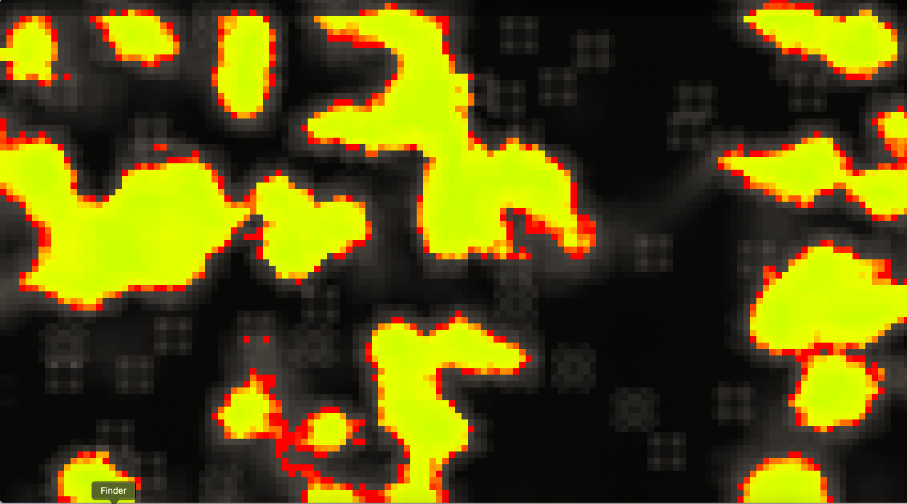

# A Generative Art Piece Based on John Conway's "Game Of Life"


This piece of software has been made using the [p5.js](https://p5js.org/) library, as well as some GLSL shaders.

## Clone and Run the Project

### Prerequisites
Make sure you have installed:
- A modern web browser (Chrome, Firefox, Edge, etc.) that is WEBGL capable
- [Visual Studio Code](https://code.visualstudio.com/) with the Live Server extension

### Clone the Repository

1. Open a terminal and run:
   ```sh
   git clone https://github.com/Neokoldstudio/p5-Game-Of-Life.git
   cd p5-Game-Of-Life
   ```

### Run the Project

Use the **Live Server** extension of VS Code:
1. Open the project in VS Code.
2. Right-click on `index.html` and select **Open with Live Server**.
3. Your browser will automatically display the project.
